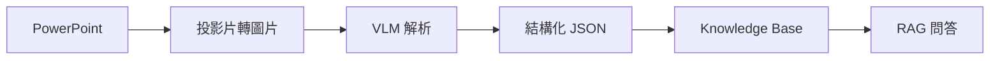
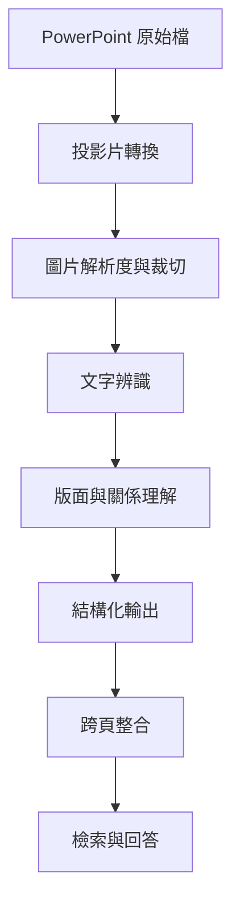
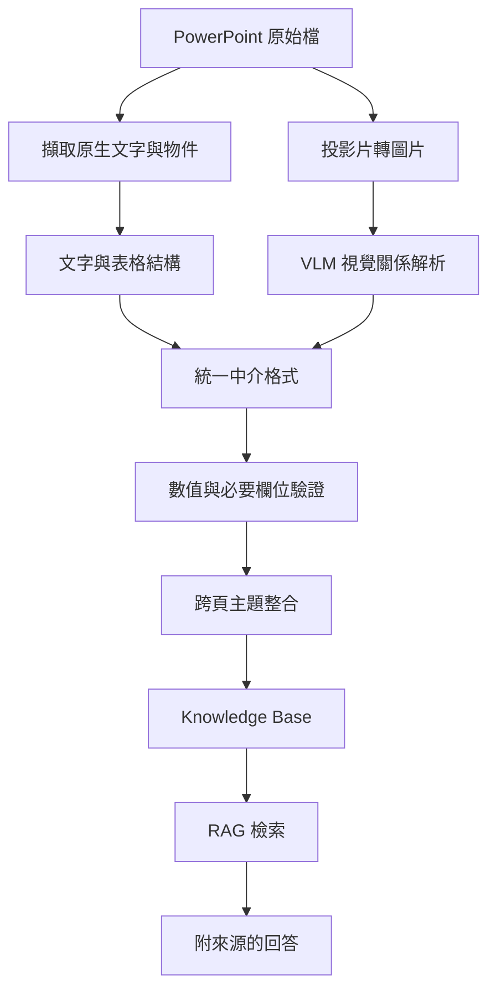

# VLM 讀得出文字，就代表它看懂投影片了嗎？

> 看見圖片\
> ≠ 辨識文字\
> ≠ 理解版面\
> ≠ 理解箭頭關係\
> ≠ 保留數值條件\
> ≠ 正確推論

在企業導入 LLM 的過程中，PowerPoint 往往是最難處理的文件格式之一。

一張投影片可能同時包含：

- 標題與內文
- 表格
- 流程圖
- 箭頭與連線
- 系統截圖
- 數值與單位
- 頁尾備註
- 延續自前一頁的資訊

當 Vision-Language Model（VLM）能夠讀出投影片上的文字時，我們很容易產生一個直覺：

> 既然文字都讀得出來，模型應該已經理解這張投影片了。

但在實際應用中，**讀得出文字**和**理解投影片**，其實是兩件不同的事。

本文將使用一份自行製作的虛構咖啡店營運簡報，拆解 VLM 理解投影片時需要具備的不同能力，並說明為什麼企業文件處理不能只依靠一次性的 VLM 摘要。

> 本文中的投影片內容、資料、名稱與數值皆為自行設計的虛構範例，不包含任何真實企業資料。

---

## 📌 案例概觀

- **一句話描述**：\
  測試 VLM 是否真的理解投影片中的資訊關係，而不只是辨識出畫面上的文字。

- **核心問題**：\
  當模型能完整輸出投影片文字時，是否也能正確理解表格、箭頭、條件、備註與跨頁資訊？

- **核心價值**：\
  將模糊的「看懂投影片」拆解成可測試、可驗證的能力，避免把 OCR 成功誤判為文件理解成功。

---

## 📖 背景分析

### 為什麼企業需要處理 PowerPoint？

企業內部有大量知識存在於簡報中，例如：

- 專案進度
- 問題追蹤
- 方案比較
- 系統架構
- 決策紀錄
- 實驗結果
- 會議結論

如果希望讓 LLM 回答歷史問題，就必須先將這些投影片轉換成可檢索、可追溯的資料。

理想中的流程可能是：

```text
PowerPoint
    ↓
文件解析
    ↓
結構化資料
    ↓
Knowledge Base
    ↓
RAG 檢索
    ↓
LLM 回答
```

但 PowerPoint 並不是單純的文字文件。

即使能從 `.pptx` 中擷取所有文字，也可能失去：

- 文字所在的位置
- 文字屬於哪個圖形
- 箭頭從哪裡指向哪裡
- 表格中的列欄關係
- 顏色或框線代表的分類
- 圖片內的資訊
- 前後頁之間的延續關係

因此，許多系統會進一步加入 VLM，希望模型能直接「看懂」整張投影片。

問題是：

> 我們要如何證明它真的看懂了？

---

## 🧠 初始假設

一開始最直覺的設計，是將投影片轉成圖片，再交由 VLM 產生結構化結果。



假設 VLM 可以同時完成：

1. 讀取投影片文字
2. 理解投影片版面
3. 判斷圖形與箭頭關係
4. 還原表格內容
5. 擷取數值與條件
6. 整理成結構化資料
7. 根據內容產生摘要

預計輸出的資料格式可能如下：

```json
{
  "topic": "",
  "problem": "",
  "discussion": [],
  "decision": "",
  "owner": "",
  "status": "",
  "conditions": [],
  "source_slide": 0
}
```

從系統設計角度來看，這個流程非常吸引人。

只要一個模型呼叫，就能完成 OCR、版面理解、資訊萃取與摘要。

但這也隱含了一個風險：

> 所有能力都被包裝在同一次回答裡，因此即使輸出結果看起來合理，也很難知道模型到底在哪個步驟發生錯誤。

---

## 🧪 實驗資料設計

為了避免使用真實企業簡報，我自行建立了一份虛構的咖啡店營運簡報。

情境設定為：

> 一家咖啡店希望改善尖峰時段的等待時間，並比較不同改善方案。

測試簡報包含以下內容：

| 投影片 | 內容 | 主要測試能力 |
| --- | --------- | ---------- |
| 1 | 問題背景與改善目標 | 文字、數值、比較條件 |
| 2 | 點餐與製作流程圖 | 箭頭方向、流程順序 |
| 3 | 飲品與製作時間表格 | 表格列欄關係 |
| 4 | 尖峰時段營運規則 | 條件、單位、備註 |
| 5 | 改善方案比較 | 多欄位比較、結論歸屬 |
| 6 | 最終決策與成功條件 | 跨頁資訊整合 |

這些投影片不追求複雜或美觀，而是刻意放入容易造成模型錯誤的元素。

---

## 🛠️ 能力一：能不能讀出文字？

第一層能力是最基本的文字辨識。

例如投影片上寫著：

```text
尖峰時段平均等待時間：12 分鐘

改善目標：
將平均等待時間降低至 8 分鐘以下
```

這一層主要檢查：

- 標題是否正確
- 小字是否遺漏
- 中英文是否混淆
- 數字是否辨識正確
- 換行是否造成語意改變
- 模型是否擅自改寫原文

如果模型輸出：

```text
目前等待時間約為 12 分鐘，目標是降低到 8 分鐘。
```

表面上看起來沒有太大問題。

但原始條件是：

```text
8 分鐘以下
```

而不是：

```text
8 分鐘
```

當文件涉及技術門檻、驗收條件或安全規則時，這種差異可能非常重要。

---

## 🛠️ 能力二：能不能理解箭頭？

第二張投影片包含以下流程：

```text
顧客
  ↓
櫃台點餐
  ↓
付款
  ↓
咖啡師製作
  ↓
取餐區
```

旁邊另外存在一條支線：

```text
線上訂單 → 咖啡師製作
```

模型不只要讀出每一個文字區塊，還要知道：

- 箭頭的起點
- 箭頭的終點
- 流程的順序
- 哪些節點存在匯流關係
- 箭頭代表流程、依賴還是資料傳遞

如果模型只能列出：

```text
顧客、櫃台點餐、付款、咖啡師製作、取餐區、線上訂單
```

代表它成功辨識了文字，但沒有證明它理解流程。

更適合的測試方式是要求模型輸出關係：

```json
[
  {
    "source": "顧客",
    "target": "櫃台點餐",
    "relationship": "下一步"
  },
  {
    "source": "線上訂單",
    "target": "咖啡師製作",
    "relationship": "直接進入製作流程"
  }
]
```

只有當起點、終點與關係都正確，才能說模型在一定程度上理解了箭頭。

---

## 🛠️ 能力三：能不能理解表格？

第三張投影片是一個飲品表格：

| 飲品 | 價格 | 平均製作時間 | 尖峰時段狀態 |
| ---- | ------ | ------ | ------ |
| 美式咖啡 | NT$80 | 2 分鐘 | 正常 |
| 拿鐵 | NT$120 | 4 分鐘 | 容易塞單 |
| 手沖咖啡 | NT$160 | 7 分鐘 | 暫停供應 |

VLM 可能正確讀出所有文字，卻仍然發生以下錯誤：

- 把拿鐵價格配到美式咖啡
- 把 7 分鐘配到拿鐵
- 將「暫停供應」理解成「永久停售」
- 忽略欄位標題
- 將表格轉成一段無法驗證的摘要

因此，比起要求模型「摘要表格」，更適合要求它保留列欄關係：

```json
[
  {
    "drink": "美式咖啡",
    "price_twd": 80,
    "production_time_minutes": 2,
    "peak_status": "正常"
  },
  {
    "drink": "拿鐵",
    "price_twd": 120,
    "production_time_minutes": 4,
    "peak_status": "容易塞單"
  },
  {
    "drink": "手沖咖啡",
    "price_twd": 160,
    "production_time_minutes": 7,
    "peak_status": "暫停供應"
  }
]
```

對企業文件而言，**所有文字都正確，但欄位關係錯誤**，通常比少讀一行文字更危險。

---

## 🛠️ 能力四：能不能保留數值與條件？

第四張投影片定義了一個營運規則：

```text
當待製作訂單 ≥ 10 杯時：

1. 暫停接受手沖咖啡訂單
2. 第二位咖啡師加入製作
3. 預估等待時間調整為 15 分鐘
```

投影片底部另外有一行灰色小字：

```text
備註：此規則目前僅在週末測試，尚未正式實施。
```

這張投影片同時測試：

- `≥` 是否被正確保留
- `10` 是否綁定正確條件
- 單位「杯」是否遺漏
- 三個執行動作是否完整
- 模型能否區分主要內容與備註
- 模型是否會把測試規則誤寫成正式政策

例如：

```text
當訂單超過 10 杯時啟動尖峰流程。
```

看起來與原文相近，但其實已經改變條件：

```text
≥ 10
```

和：

```text
> 10
```

並不相同。

此外，如果模型摘要為：

```text
咖啡店在訂單過多時會暫停手沖咖啡，並安排第二位咖啡師支援。
```

它可能完全忽略：

```text
尚未正式實施
```

這就可能把「測試中的方案」錯誤轉換成「已經上線的制度」。

---

## 🛠️ 能力五：能不能正確比較方案？

第五張投影片包含三個候選方案：

| 方案 | 成本 | 預估等待時間 | 評估結果 |
| -------- | ------------ | ------ | -------- |
| 增加一台咖啡機 | NT$120,000 | 7 分鐘 | 成本較高 |
| 增加一位尖峰人員 | 每月 NT$35,000 | 8 分鐘 | 建議試行 |
| 減少飲品品項 | NT$0 | 9 分鐘 | 顧客體驗可能下降 |

如果只問模型：

> 哪一個方案最好？

模型可能選擇等待時間最短的「增加一台咖啡機」。

但投影片中的正式建議是：

```text
增加一位尖峰人員
```

因為這是一個同時考量成本、效果與風險後的決策。

這裡測試的已經不只是 OCR，而是模型能否理解：

- 哪個數值屬於哪個方案
- 成本是一次性還是每月支出
- 哪一欄是分析結果
- 哪個方案是正式建議
- 哪些內容是模型自行推論

模型可能做出合理推論，但「合理」不等於「符合原始文件」。

在企業 Knowledge Base 中，系統應優先回答文件中的正式結論，而不是自行替使用者重新做決策。

---

## 🛠️ 能力六：能不能整合跨頁資訊？

最後一張投影片只包含最終決策：

```text
最終決定：

先試行增加一位尖峰人員，
四週後重新評估。

成功條件：

平均等待時間 < 8 分鐘
顧客抱怨數不得增加
```

要完整回答這個案例，模型必須整合前面多張投影片：

1. 原始問題是什麼？
2. 目前等待時間是多少？
3. 有哪些候選方案？
4. 為什麼選擇增加尖峰人員？
5. 這是正式導入還是試行？
6. 試行多久？
7. 成功條件是什麼？

單頁解析正確，不代表跨頁結論正確。

例如，模型可能把第五頁的「8 分鐘」與第六頁的：

```text
< 8 分鐘
```

混為一談。

它也可能將：

```text
建議試行
```

改寫成：

```text
決定正式增加人力
```

因此，跨頁理解必須同時處理：

- 時間順序
- 狀態變化
- 方案與決策的對應
- 條件更新
- 來源追溯

---

## 📊 評估方式

與其只判斷模型回答「看起來對不對」，更適合將能力分開評估。

| 能力 | 評估內容 | 結果 |
| ----- | -------------- | --- |
| 文字辨識 | 文字、數字與專有名詞是否完整 | 待實測 |
| 版面理解 | 標題、本文、備註是否正確分類 | 待實測 |
| 箭頭理解 | 起點、終點與方向是否正確 | 待實測 |
| 表格理解 | 列、欄與數值是否正確對應 | 待實測 |
| 條件保留 | 比較符號、單位與門檻是否完整 | 待實測 |
| 內容分級 | 正式結論與備註是否分開 | 待實測 |
| 跨頁整合 | 不同頁面的資訊是否正確串接 | 待實測 |
| 推論忠實度 | 是否加入原文不存在的推論 | 待實測 |

每個測試案例都應保存：

- 原始投影片
- 人工標註的 Ground Truth
- 使用的 Prompt
- 模型名稱與版本
- 推論參數
- 模型原始輸出
- 錯誤類型
- 是否可以穩定重現

---

## 🔍 問題不一定只出在模型

當 VLM 解析失敗時，不應立刻得出：

> 這個模型不夠強。

錯誤可能發生在不同階段：



常見原因包括：

- 投影片轉圖片時解析度不足
- 小字或頁尾被縮得太小
- Prompt 鼓勵摘要，而不是忠實擷取
- 一次輸入過多頁面
- JSON Schema 無法表達箭頭關係
- 表格存在合併儲存格
- 模型根據上下文猜測缺失內容
- 跨頁整合時混淆不同版本的結論
- Retrieval 階段沒有取回完整來源

因此，VLM 文件解析不只是模型選型問題，而是完整的系統設計問題。

---

## 🏗️ 比較可靠的系統架構

與其讓 VLM 一次完成所有任務，更穩定的方式是將流程拆開。



不同工具負責不同任務：

- PowerPoint Parser：擷取原生文字、表格與物件
- OCR：處理圖片或截圖中的文字
- VLM：補充視覺版面、箭頭與圖片關係
- Rule-based Validator：驗證數值、單位與必要欄位
- LLM：進行語意整合與摘要
- Human Review：覆核高風險或低信心內容

建議的中介資料格式如下：

```json
{
  "slide_id": "coffee-operation-slide-04",
  "title": "尖峰時段營運規則",
  "text_blocks": [],
  "tables": [],
  "visual_relations": [],
  "conditions": [
    {
      "field": "pending_orders",
      "operator": ">=",
      "value": 10,
      "unit": "cups"
    }
  ],
  "main_content": [],
  "notes": [
    {
      "text": "此規則目前僅在週末測試，尚未正式實施。",
      "status": "experimental"
    }
  ],
  "uncertain_items": [],
  "source_reference": {
    "file": "synthetic-coffee-operation.pptx",
    "slide": 4
  }
}
```

這種設計的重點不是讓模型永遠不犯錯，而是讓錯誤：

- 可以被定位
- 可以被驗證
- 可以被追溯
- 可以被修正

---

## 💡 經驗萃取

### 1. 不要把 OCR 成功當成文件理解成功

模型能讀出所有文字，只證明它完成了部分視覺文字辨識。

它不一定理解：

- 文字之間的關係
- 圖形與文字的歸屬
- 表格中的列欄關係
- 數值條件的實際意義
- 備註與正式結論的差異

### 2. 摘要通順不代表內容正確

LLM 很擅長產生語句通順、邏輯合理的回答。

但企業文件處理最需要的是：

> 忠實、可驗證、可追溯。

一段讀起來很合理的摘要，可能已經遺漏門檻值、狀態或限制條件。

### 3. 必須將能力拆成獨立測試項目

「模型能不能看懂投影片」太過模糊。

更具體的問題應該是：

- 能不能讀出文字？
- 能不能理解閱讀順序？
- 能不能還原箭頭？
- 能不能理解表格？
- 能不能保留比較符號？
- 能不能區分備註？
- 能不能整合跨頁資訊？
- 能不能附上正確來源？

### 4. Production 的關鍵不是模型更大

更大的模型可能改善部分案例，但不能取代：

- 資料前處理
- 結構化設計
- 規則驗證
- 來源追溯
- 錯誤處理
- 人工覆核機制

企業 AI 系統的可靠性，通常來自整體架構，而不是單一模型。

---

## 🎯 能力分級

可以將投影片理解能力分成以下層級：

```text
Level 1：看見圖片
Level 2：辨識文字
Level 3：理解版面與閱讀順序
Level 4：理解箭頭、框線與視覺關係
Level 5：保留數值、單位與條件
Level 6：理解表格與結構化資訊
Level 7：整合跨區塊與跨頁資訊
Level 8：根據完整資訊忠實回答
```

通過前一個層級，不代表模型自然具備下一個層級。

因此，在選擇 VLM 或建立 Benchmark 時，也不應只比較一個整體正確率，而應該確認模型究竟在哪一層開始失敗。

---

## 🧾 結論

VLM 能讀出投影片上的文字，不代表它已經理解整張投影片。

真正的投影片理解至少包含：

- 文字辨識
- 版面理解
- 視覺關係解析
- 表格結構還原
- 數值與條件保留
- 內容角色判斷
- 跨頁資訊整合
- 忠實且可追溯的推論

因此，評估一套企業投影片 Knowledge Base 時，不應只問：

> 模型能不能產生一段合理的摘要？

而應該進一步問：

> 模型在哪一個理解層級開始失敗？\
> 這些錯誤是否能被系統偵測？\
> 最終答案能否回到原始投影片進行驗證？

VLM 可以是企業多模態文件處理的重要元件，但它不應該被視為一個能獨立完成所有工作的黑盒子。

從 Demo 走向 Production，真正重要的不是讓模型「看起來懂了」，而是建立一套能證明它在什麼條件下真的理解、在什麼情況下不值得信任的驗證機制。

---

## 📚 參考資料與待補實驗

- [ ] 公開測試用 PowerPoint
- [ ] 投影片圖片與 Ground Truth
- [ ] 測試 Prompt
- [ ] 模型與版本紀錄
- [ ] 文字辨識結果
- [ ] 箭頭關係測試
- [ ] 表格結構測試
- [ ] 數值與條件測試
- [ ] 跨頁資訊測試
- [ ] 多次推論穩定性測試
- [ ] 不同模型比較
- [ ] 完整實驗結果與錯誤案例
