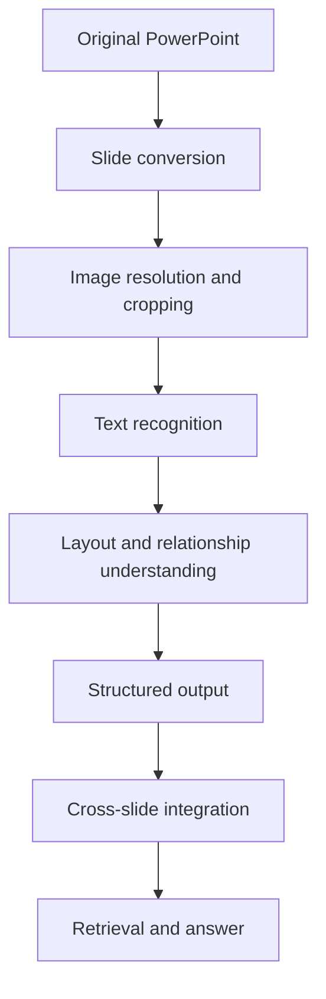
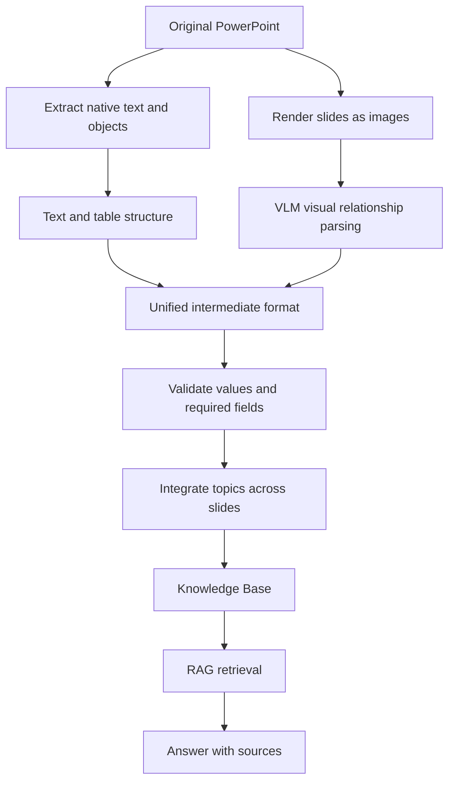

# If a VLM Can Read the Text, Does It Understand the Slide?

> Seeing an image\
> ≠ recognizing text\
> ≠ understanding layout\
> ≠ understanding arrow relationships\
> ≠ preserving numeric conditions\
> ≠ reasoning correctly

PowerPoint is often one of the hardest document formats to process when introducing LLMs into an enterprise.

A single slide may contain all of the following at once:

- Titles and body text
- Tables
- Flowcharts
- Arrows and connectors
- System screenshots
- Values and units
- Footer notes
- Information continued from a previous slide

Once a Vision-Language Model (VLM) can read the text on a slide, it is tempting to assume that it understands the slide as well.

In practice, however, **reading the text** and **understanding the slide** are different capabilities.

This article uses a synthetic coffee-shop operations deck to break slide understanding into distinct capabilities. It also explains why enterprise document processing should not depend on a one-shot VLM summary.

> All slide content, data, names, and figures in this article were created for demonstration purposes and contain no real company information.

---

## 📌 Case Overview

- **In one sentence**:\
  Test whether a VLM truly understands the relationships shown on a slide instead of merely recognizing its visible text.

- **Core question**:\
  If a model can reproduce all the text, can it also interpret tables, arrows, conditions, notes, and information spanning multiple slides correctly?

- **Why it matters**:\
  Turning the vague idea of “understanding a slide” into testable, verifiable capabilities prevents OCR success from being mistaken for document-understanding success.

---

## 📖 Background

### Why Do Enterprises Need to Process PowerPoint Files?

Large amounts of organizational knowledge live in presentations, including:

- Project status
- Issue tracking
- Option comparisons
- System architecture
- Decision records
- Experiment results
- Meeting conclusions

To let an LLM answer questions about this history, the slides first need to become searchable and traceable data.

An idealized pipeline might look like this:

```text
PowerPoint
    ↓
Document parsing
    ↓
Structured data
    ↓
Knowledge Base
    ↓
RAG retrieval
    ↓
LLM answer
```

PowerPoint, however, is not a plain-text format. Even if every string can be extracted from the `.pptx`, the process may lose:

- Where each text block appears
- Which shape a piece of text belongs to
- Where an arrow begins and ends
- Row and column relationships in tables
- Categories encoded by color or borders
- Information embedded in images
- Continuity between adjacent slides

Many systems therefore add a VLM in the hope that it can “understand” the entire rendered slide. The question is:

> How do we prove that it really understood it?

---

## 🧠 Initial Hypothesis

The most intuitive design is to render each slide as an image and ask a VLM to produce structured output.


This assumes that the VLM can perform all of the following:

1. Read the slide text
2. Understand the layout
3. Interpret shapes and arrow relationships
4. Reconstruct tables
5. Extract values and conditions
6. Organize the result into structured data
7. Summarize the content

A possible output schema might be:

```json
{
  "topic": "",
  "problem": "",
  "discussion": [],
  "decision": "",
  "owner": "",
  "status": "",
  "conditions": [],
  "source_slide": 0
}
```

From a system-design perspective, this is attractive: a single model call appears to handle OCR, layout understanding, information extraction, and summarization.

It also hides a serious risk:

> Because every capability is wrapped inside one answer, a plausible-looking result gives us little evidence about which step—if any—failed.

---

## 🧪 Designing the Test Data

To avoid using a real corporate presentation, I created a fictional coffee-shop operations deck.

The scenario is simple:

> A coffee shop wants to reduce wait times during peak hours and compare several improvement options.

The test deck contains:

| Slide | Content | Primary capability tested |
| --- | --- | --- |
| 1 | Current peak-hour performance and a four-week target | Text, values, ranges, time conditions, and small-print notes |
| 2 | In-store and online order flows | Arrow direction, convergence, and the payment-failure loop |
| 3 | Production times and status for four drinks | Table row/column relationships, integers, and decimals |
| 4 | Operating rules triggered by a pending-order threshold | Comparison operators, units, calculation scope, and notes |
| 5 | Comparison of three improvement options | Multi-column comparison, evaluation principles, and formal recommendation |
| 6 | Pilot decision and three success criteria | Cross-slide information, status, dates, and condition integration |

The slides were intentionally designed to contain elements that commonly cause model errors, rather than to be visually elaborate.

---

## 🔬 Test Setup and Results

I ran an exploratory test on this deck with GPT-5.6 Luna. The goal was not to claim that one model is the strongest based on a single run, but to observe the differences among summaries, structured extraction, and cross-slide Q&A.

### Test Setup

- Test date: 2026-08-08
- Model: `gpt-5.6-luna` (the `model_claimed` value in the output)
- Reasoning effort: `medium`
- Image detail: not explicitly specified; recorded as the API default, `auto`
- Snapshot: no dated snapshot identifier was supplied; model ID recorded as `gpt-5.6-luna`
- Image input: six 1600 × 900 PNG files exported from PowerPoint
- Ground truth: manually verified against text, tables, and connectors in the original `.pptx`
- Method: summary, structured extraction, and cross-slide Q&A were run separately
- Scope: a single pilot used to validate the method, not a cross-model benchmark

I used three prompts:

```text
Prompt A | Summary
Summarize this slide in one sentence, using no more than 40 Chinese characters.

Prompt B | Structured extraction
Output only the requested JSON based on the image.
Preserve comparison operators, units, notes, and arrow directions. Do not add inferences that are not present in the image.
Return null for any field that cannot be confirmed.

Prompt C | Cross-slide Q&A
Answer seven questions covering the current situation, process, rules, options, and decision. Include source slide numbers.
```

### A Reasonable One-Sentence Summary Can Still Omit Critical Details

Prompt A produced these summaries:

```text
Slide 1: Average weekday-afternoon peak wait time is 12 minutes, with a target below 8 minutes within four weeks.
Slide 2: In-store and online orders proceed to preparation after payment or system confirmation; failed payments return to payment.
Slide 3: Lattes tend to create a backlog, pour-over coffee is temporarily unavailable, and other drinks are normal.
Slide 4: When production orders reach 10 cups, pause pour-over orders, add a barista, and show a 15-minute estimated wait.
Slide 5: A pilot adding one peak-hour employee is recommended, with an estimated wait time of 8 minutes.
Slide 6: Beginning September 1, add one peak-hour employee for a four-week pilot with three success criteria.
```

All six are reasonable, yet they omit the exact time window, the exclusion of delivery orders, the pickup area, table values, the counting scope and pilot status of the pending-order rule, option costs and risks, and the actual thresholds for the three success criteria. Slide 4 also shortens “pending orders” to “production orders.” These are not necessarily vision failures; they are information discarded by the summarization task itself.

### With an Explicit Schema, All 60 Defined Fields Matched in This Run

Prompt B split each information category into atomic, verifiable fields:

| Test item | Atomic fields | Exact matches | Result |
| --- | ---: | ---: | ---: |
| Slide 1: text, time, and conditions | 6 | 6 | 100% |
| Slide 2: nodes and arrow relationships | 7 | 7 | 100% |
| Slide 3: table cells | 16 | 16 | 100% |
| Slide 4: threshold, actions, scope, and note | 8 | 8 | 100% |
| Slide 5: option comparison and evaluation principle | 16 | 16 | 100% |
| Slide 6: decision and success criteria | 7 | 7 | 100% |
| **Total** | **60** | **60** | **100%** |

This 100% refers specifically to the 60 predefined core fields. Arrows, tables, thresholds, operators, costs, status, and success criteria were all mapped correctly. All seven cross-slide questions were also answered correctly with the right source slides.

### Correct Core Fields Do Not Mean a Perfect Verbatim Transcription

When the evaluation criterion is raised to require every visible word to match exactly, small errors remain:

| Location | Original slide | Luna output | Error type |
| --- | --- | --- | --- |
| Headers on slides 1, 3, and 5 | “Understood the slide?” | “Understood the video?” | Missing character in Chinese |
| Subtitle on slide 2 | “Two order sources converge” | “Two order sources flow” | Missing character in Chinese |
| Headers on slides 2, 4, and 6 | Repeated header text | Absent from `text_blocks` | Omission |

More importantly, every `uncertain_items` array in the JSON was empty. The model neither flagged these errors nor showed any uncertainty about its transcription.

A more precise conclusion for this run is therefore:

- Core semantic and structured fields: 60/60
- Cross-slide decision Q&A: 7/7
- Strict verbatim fidelity: minor omissions remain
- Uncertainty reporting: the model did not detect its own small transcription errors

The key finding is not that “the model got everything right,” but this:

> With the same model and the same images, a summary can be reasonable yet incomplete; structured fields can all be correct while verbatim transcription still contains errors. These differences become visible only when the evaluation is decomposed.

Raw outputs: [one-sentence summaries](/data/articles/cooking/gpt-5.6-luna-summary.txt), [structured JSON](/data/articles/cooking/gpt-5.6-luna-structured-output.json), and [cross-slide Q&A](/data/articles/cooking/gpt-5.6-luna-cross-page.txt).

---

## 🛠️ Capability 1: Can It Read the Text?

The first layer is basic text recognition.


*Figure 1: The first slide combines a time range, current value, deadline, comparison operator, and exclusion condition.*

```text
Weekday afternoons, 12:00–14:00
Average wait time: 12 minutes

Improvement target:
Reduce average wait time to ≤ 8 minutes within four weeks

Data excludes delivery orders.
```

This layer checks whether:

- Titles are correct
- Small print is omitted
- Chinese and English are confused
- Numbers are recognized correctly
- Line breaks alter meaning
- The model paraphrases source text without permission

An output such as “The current wait is around 12 minutes, and the target is 8 minutes” looks close enough, but the original says `≤ 8 minutes`, not `< 8 minutes`. Natural language often blurs this distinction; rules and acceptance criteria cannot. “Within four weeks,” the exact peak-hour range, and the exclusion of delivery orders are also conditions that must not disappear in a summary.

---

## 🛠️ Capability 2: Can It Understand Arrows?

The second slide contains two order sources that converge:


*Figure 2: Two order sources converge at barista preparation, while a failed payment loops back to the payment step.*

```text
In-store customer → Counter order → Payment ─────┐
                                                  ↓
Online order → System confirmation ─────────→ Barista preparation → Pickup area
```

There is also a return path:

```text
Payment failure → Return to payment
```

The model must identify not only the text blocks, but also each arrow's source, target, direction, sequence, convergence, and meaning. A flat list of node labels proves text recognition, not process understanding.

A more useful test asks for explicit relationships:

```json
[
  { "source": "In-store customer", "target": "Counter order", "relationship": "next step" },
  { "source": "Online order", "target": "System confirmation", "relationship": "next step" },
  { "source": "System confirmation", "target": "Barista preparation", "relationship": "joins preparation flow" },
  { "source": "Payment failure", "target": "Payment", "relationship": "returns to" }
]
```

Only when sources, targets, directions, convergence, and loops are correct can we say the model understands the arrows to some degree. Visual proximity alone does not prove that two objects are connected.

---

## 🛠️ Capability 3: Can It Understand a Table?

The third slide contains a drink table:


*Figure 3: The table mixes integers and decimals and uses “temporarily unavailable” to test whether the model changes the status.*

| Drink | Price | Average production time | Peak-hour status |
| --- | --- | --- | --- |
| Americano | NT$80 | 2 minutes | Normal |
| Latte | NT$120 | 4 minutes | Prone to backlog |
| Pour-over coffee | NT$160 | 7 minutes | Temporarily unavailable |
| Iced tea | NT$90 | 1.5 minutes | Normal |

A VLM may read every word correctly and still attach the latte price to the Americano, assign seven minutes to the latte, reinterpret “temporarily unavailable” as “permanently discontinued,” ignore headers, or flatten the table into an unverifiable summary.

Instead of asking it to summarize the table, preserve row and column relationships:

```json
[
  { "drink": "Americano", "price_twd": 80, "production_time_minutes": 2, "peak_status": "normal" },
  { "drink": "Latte", "price_twd": 120, "production_time_minutes": 4, "peak_status": "prone to backlog" },
  { "drink": "Pour-over coffee", "price_twd": 160, "production_time_minutes": 7, "peak_status": "temporarily unavailable" },
  { "drink": "Iced tea", "price_twd": 90, "production_time_minutes": 1.5, "peak_status": "normal" }
]
```

For enterprise documents, getting every word right while associating fields incorrectly is often more dangerous than missing a line.

---

## 🛠️ Capability 4: Can It Preserve Values and Conditions?

The fourth slide defines an operating rule:


*Figure 4: The threshold, actions, calculation scope, and footer note occupy separate visual regions.*

```text
When pending orders ≥ 10 cups:

1. Stop accepting pour-over coffee orders
2. A second barista joins preparation
3. The system displays an estimated 15-minute wait

Calculation scope: excludes completed orders that have not yet been picked up
```

A gray note at the bottom adds:

```text
Note: This rule is currently being piloted on Saturdays and Sundays only. It has not been formally implemented.
```

This slide tests whether the model preserves `≥`, binds `10` to the right condition, retains the unit “cups,” captures all three actions and the calculation scope, distinguishes the note from primary content, and avoids describing an experimental rule as official policy.

“When orders exceed 10 cups” looks similar but changes `≥ 10` into `> 10`. A summary may also omit “not formally implemented,” turning a trial into a live policy.

---

## 🛠️ Capability 5: Can It Compare Options Correctly?

The fifth slide compares three candidates:


*Figure 5: The option with the shortest wait is not the formal recommendation. The evaluation principle, risks, and final assessment all matter.*

Evaluation principle: prioritize options that can be executed within four weeks.

| Option | Cost | Estimated wait | Risk | Assessment |
| --- | --- | --- | --- | --- |
| Add one coffee machine | NT$120,000 | 7 minutes | Insufficient space | Do not adopt for now |
| Add one peak-hour employee | NT$35,000/month | 8 minutes | Recruiting lead time | Recommend a pilot |
| Reduce drink selection | NT$0 | 9 minutes | Less customer choice | Do not adopt |

If asked only which option is “best,” a model may choose the coffee machine because it produces the shortest estimated wait. The formal recommendation, however, is to add one peak-hour employee after considering four-week feasibility, cost, effect, and risk.

The test is no longer just OCR. The model must understand which values belong to which option, whether a cost is one-time or monthly, which column contains the decision, what the formal recommendation is, and which statements are its own inference.

A plausible inference is not necessarily faithful to the source. In an enterprise knowledge base, the system should report the documented decision before attempting to make a new one for the user.

---

## 🛠️ Capability 6: Can It Integrate Information Across Slides?

The final slide records the decision:


*Figure 6: The decision combines a start date, pilot duration, three success criteria, and a later evaluation status.*

```text
Final decision:

Starting September 1, pilot one additional peak-hour employee for four weeks.

Success criteria for the four-week pilot:

Average wait time < 8 minutes
Customer complaints must not increase
Monthly personnel cost must not exceed NT$40,000

After four weeks, evaluate whether to adopt the change formally.
```

To answer the case completely, the model must integrate several slides: the original problem, current wait, candidate options, reason for the selection, pilot versus formal rollout status, timing, duration, and all three success criteria.

Correct single-slide extraction does not guarantee correct cross-slide conclusions. The model may conflate the fifth slide's estimate of “8 minutes” with the sixth slide's criterion of `< 8 minutes`, or rewrite “recommend a pilot” as “formally decided to increase staffing.” Cross-slide understanding therefore needs to preserve chronology, status changes, option-to-decision relationships, updated conditions, and source traceability.

---

## 📊 Evaluation Method

Instead of asking whether an answer merely “looks right,” evaluate each capability separately.

| Capability | What is evaluated | Result |
| --- | --- | --- |
| Text recognition | Completeness of text, numbers, and proper nouns | Core text correct; omissions in headers and subtitle |
| Layout understanding | Correct classification of title, body, and notes | Primary regions and notes classified correctly |
| Arrow understanding | Correct sources, targets, and direction | 7/7 |
| Table understanding | Correct row, column, and value associations | 16/16 |
| Condition preservation | Complete operators, units, and thresholds | All tested fields correct |
| Content status | Separation of formal decisions and notes | Pilot, not-yet-formal, and final-decision states distinguished correctly |
| Cross-slide integration | Correct linkage of information across slides | 7/7 questions with correct source slides |
| Faithful inference | Whether unsupported inferences were added | No substantive additions found |

Every test case should preserve the original slide, annotated ground truth, prompt, model and version, inference parameters, raw output, error classification, and reproducibility notes.

---

## 🔍 The Model Is Not Always the Only Source of Failure

When VLM parsing fails, “the model is not strong enough” is not the only possible diagnosis.



Common causes include low rendering resolution, small footer text, a prompt that rewards summarization instead of faithful extraction, too many pages in one request, a JSON schema unable to express arrow relationships, merged table cells, contextual guessing, confusion between different decision versions, and retrieval that fails to return all relevant sources.

VLM document parsing is therefore a system-design problem, not merely a model-selection problem.

---

## 🏗️ A More Reliable Architecture

Instead of asking a VLM to perform every task at once, separate the pipeline.



Different tools can own different responsibilities:

- PowerPoint parser: native text, tables, and objects
- OCR: text embedded in images or screenshots
- VLM: layout, arrows, and visual relationships
- Rule-based validator: values, units, and required fields
- LLM: semantic integration and summarization
- Human review: high-risk or low-confidence content

A useful intermediate representation might be:

```json
{
  "slide_id": "coffee-operation-slide-04",
  "title": "Peak-hour operating rules",
  "text_blocks": [],
  "tables": [],
  "visual_relations": [],
  "conditions": [
    { "field": "pending_orders", "operator": ">=", "value": 10, "unit": "cups" }
  ],
  "main_content": [],
  "notes": [
    { "text": "This rule is being tested on weekends only and has not been formally implemented.", "status": "experimental" }
  ],
  "uncertain_items": [],
  "source_reference": { "file": "synthetic-coffee-operation.pptx", "slide": 4 }
}
```

The goal is not to make the model infallible. It is to make errors locatable, verifiable, traceable, and correctable.

---

## 💡 Lessons Learned

### 1. Do Not Mistake OCR Success for Document Understanding

Reading all visible text demonstrates only part of visual text recognition. It does not prove that the model understands relationships, shape ownership, table structure, numeric meaning, or the difference between a note and a formal conclusion.

### 2. A Fluent Summary Is Not Necessarily a Correct One

LLMs are excellent at producing coherent, plausible language. Enterprise document systems, however, need output that is **faithful, verifiable, and traceable**. A polished summary may silently discard thresholds, states, or constraints.

### 3. Test Capabilities Independently

“Can the model understand a slide?” is too vague. Ask whether it can read text, infer reading order, reconstruct arrows, interpret tables, preserve operators, classify notes, combine information across slides, and cite the right source.

### 4. Production Reliability Does Not Come Only From a Larger Model

A stronger model may improve some cases, but it cannot replace preprocessing, structured representations, validation rules, source traceability, error handling, and human review. Enterprise AI reliability usually comes from the architecture as a whole.

---

## 🎯 Capability Levels

Slide understanding can be divided into levels:

```text
Level 1: See the image
Level 2: Recognize text
Level 3: Understand layout and reading order
Level 4: Understand arrows, borders, and visual relationships
Level 5: Preserve values, units, and conditions
Level 6: Understand tables and structured information
Level 7: Integrate information across regions and slides
Level 8: Answer faithfully using complete information
```

Passing one level does not imply that the next comes automatically. A VLM benchmark should therefore identify the level at which a model starts to fail rather than reporting only a single overall accuracy score.

---

## 🧾 Conclusion

A VLM's ability to read the words on a slide does not prove that it understands the slide.

True slide understanding requires text recognition, layout understanding, visual relationship parsing, table reconstruction, condition preservation, content-role classification, cross-slide integration, and faithful, traceable reasoning.

When evaluating an enterprise presentation knowledge base, we should not ask only:

> Can the model produce a reasonable summary?

We should also ask:

> At which level of understanding does the model begin to fail?\
> Can the system detect those failures?\
> Can the final answer be verified against the original slide?

A VLM can be an important component in enterprise multimodal document processing, but it should not be treated as a black box capable of doing everything on its own.

The move from demo to production is not about making the model look as if it understands. It is about building a validation system that proves when the model truly understands—and identifies when it should not be trusted.

---

## 📚 References and Follow-up Experiments

- [x] Synthetic test PowerPoint
- [x] Slide images and ground truth
- [x] Test prompts
- [x] Model name recorded
- [ ] Complete inference parameters and snapshot recorded
- [x] Text-recognition results
- [x] Arrow-relationship test
- [x] Table-structure test
- [x] Values-and-conditions test
- [x] Cross-slide test
- [ ] Repeated-run stability test
- [ ] Comparison across models
- [ ] Complete experiment results and error cases
