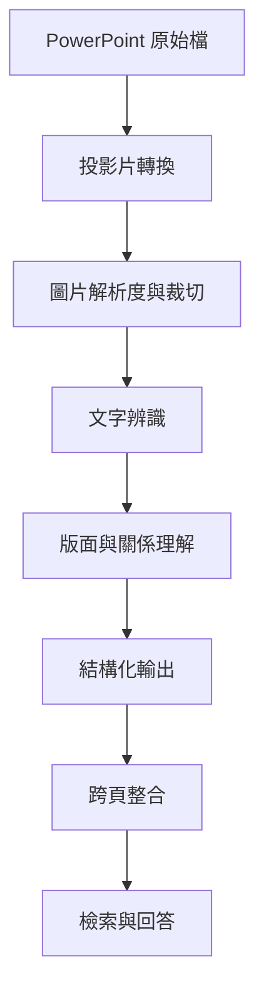
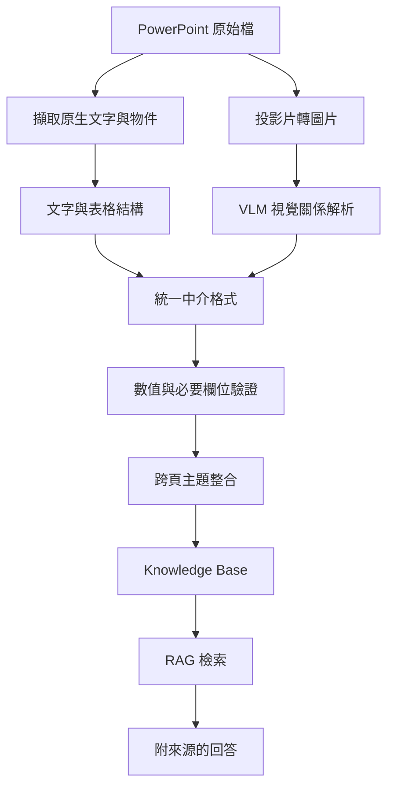

# VLM 讀得出文字，就代表它看懂投影片了嗎？

> 看見圖片\
> ≠ 辨識文字\
> ≠ 理解版面\
> ≠ 理解箭頭關係\
> ≠ 保留數值條件\
> ≠ 正確推論

在企業導入 LLM 的過程中，PowerPoint 往往是最難處理的文件格式之一。

一張投影片可能同時包含：

- 標題與內文
- 表格
- 流程圖
- 箭頭與連線
- 系統截圖
- 數值與單位
- 頁尾備註
- 延續自前一頁的資訊

當 Vision-Language Model（VLM）能夠讀出投影片上的文字時，我們很容易產生一個直覺：

> 既然文字都讀得出來，模型應該已經理解這張投影片了。

但在實際應用中，**讀得出文字**和**理解投影片**，其實是兩件不同的事。

本文將使用一份自行製作的虛構咖啡店營運簡報，拆解 VLM 理解投影片時需要的不同能力，並說明為什麼企業文件處理不能只依賴一次 VLM 摘要。

> 本文中的投影片內容、資料、名稱與數值皆為自行設計的虛構範例，不包含任何真實企業資料。

---

## 📌 案例概觀

- **一句話描述**：\
  測試 VLM 是否真的理解投影片中的資訊關係，而不只是辨識出畫面上的文字。

- **核心問題**：\
  當模型能完整輸出投影片文字時，是否也能正確理解表格、箭頭、條件、備註與跨頁資訊？

- **核心價值**：\
  將模糊的「看懂投影片」拆解成可測試、可驗證的能力，避免把 OCR 成功誤判為文件理解成功。

---

## 📖 背景分析

### 為什麼企業需要處理 PowerPoint？

企業內部有大量知識存在於簡報中，例如：

- 專案進度
- 問題追蹤
- 方案比較
- 系統架構
- 決策紀錄
- 實驗結果
- 會議結論

如果希望讓 LLM 回答歷史問題，就必須先將這些投影片轉換成可檢索、可追溯的資料。

理想中的流程可能是：

```text
PowerPoint
    ↓
文件解析
    ↓
結構化資料
    ↓
    知識庫（Knowledge Base）
    ↓
RAG 檢索
    ↓
LLM 回答
```

但 PowerPoint 並不是單純的文字文件。

即使能從 `.pptx` 中擷取所有文字，也可能失去：

- 文字所在的位置
- 文字屬於哪個圖形
- 箭頭從哪裡指向哪裡
- 表格中的列欄關係
- 顏色或框線代表的分類
- 圖片內的資訊
- 前後頁之間的延續關係

因此，許多系統會進一步加入 VLM，希望模型能直接「看懂」整張投影片。

問題是：

> 我們要如何證明它真的看懂了？

---

## 🧠 初始假設

一開始最直覺的設計，是將投影片轉成圖片，再交由 VLM 產生結構化結果。


假設 VLM 可以同時完成：

1. 讀取投影片文字
2. 理解投影片版面
3. 判斷圖形與箭頭關係
4. 還原表格內容
5. 擷取數值與條件
6. 整理成結構化資料
7. 根據內容產生摘要

預計輸出的資料格式可能如下：

```json
{
  "topic": "",
  "problem": "",
  "discussion": [],
  "decision": "",
  "owner": "",
  "status": "",
  "conditions": [],
  "source_slide": 0
}
```

從系統設計角度來看，這個流程非常吸引人。

只要一個模型呼叫，就能完成 OCR、版面理解、資訊萃取與摘要。

但這也隱含了一個風險：

> 所有能力都被包裝在同一次回答裡，因此即使輸出結果看起來合理，也很難知道模型到底在哪個步驟發生錯誤。

---

## 🧪 實驗資料設計

為了避免使用真實企業簡報，我自行建立了一份虛構的咖啡店營運簡報。

情境設定為：

> 一家咖啡店希望改善尖峰時段的等待時間，並比較不同改善方案。

測試簡報包含以下內容：

| 投影片 | 內容 | 主要測試能力 |
| --- | --------- | ---------- |
| 1 | 尖峰時段現況與四週改善目標 | 文字、數值、範圍、時間條件、小字備註 |
| 2 | 現場與線上訂單流程 | 箭頭方向、匯流、付款失敗回流 |
| 3 | 四種飲品的製作時間與狀態 | 表格列欄關係、整數與小數 |
| 4 | 待製作訂單達門檻時的營運規則 | 比較符號、單位、計算範圍、備註 |
| 5 | 三個改善方案的比較 | 多欄位比較、評估原則、正式建議 |
| 6 | 試行決策與三項成功條件 | 跨頁資訊、狀態、日期與條件整合 |

這些投影片不追求複雜或美觀，而是刻意放入容易造成模型錯誤的元素。

---

## 🔬 實測設定與結果

我用這份簡報對 GPT-5.6 Luna 做了一輪探索性實測，目的不是用單次結果宣稱哪個模型最強，而是確認摘要、結構化擷取與跨頁問答之間會出現什麼差異。

### 測試設定

- 測試日期：2026-08-08
- 測試模型：`gpt-5.6-luna`（模型輸出中的 `model_claimed`）
- Reasoning effort：`medium`
- Image detail：未明確指定；按 API 預設記為 `auto`
- 模型快照：未提供日期版識別，記錄 model ID `gpt-5.6-luna`
- 圖片輸入：PowerPoint 匯出的六張 1600 × 900 PNG
- 人工核對基準（Ground Truth）：以原始 `.pptx` 中的文字、表格與連線逐項核對
- 測試方式：摘要、結構化擷取、跨頁問答分開執行
- 測試性質：單次試驗（pilot）；用來驗證方法，不當作跨模型基準測試

我使用三組提示（Prompt）：

```text
Prompt A｜摘要
請用一句話摘要這張投影片，不超過 40 字。

Prompt B｜結構化擷取
只依圖片輸出指定 JSON。
保留比較符號、單位、備註與箭頭方向；不得補充圖片中不存在的推論。
無法確認的欄位請回傳 null。

Prompt C｜跨頁問答
回答七個涵蓋現況、流程、規則、方案與決策的問題，並附來源頁碼。
```

### 一句話摘要看似正確，卻省略了什麼？

Prompt A 得到的摘要如下：

```text
第 1 頁：平日下午尖峰平均等候12分鐘，目標四週內降至8分鐘以下。
第 2 頁：現場與線上訂單經付款或系統確認後製作，付款失敗則返回付款。
第 3 頁：拿鐵容易塞單，手沖咖啡暫停供應，其餘飲品正常。
第 4 頁：製作訂單達10杯時暫停手沖、增派咖啡師並預估等候15分鐘。
第 5 頁：建議試行增加一位尖峰人員，預估等候時間為8分鐘。
第 6 頁：自9月1日起試行增加一位尖峰人員四週，設三項成功條件。
```

六句話都算合理，但仍省略了精確時段與外送訂單排除條件、取餐區、表格數值、待製作訂單的計算範圍與試行狀態、方案成本與風險，以及三項成功條件的實際門檻。第 4 頁還把「待製作訂單」縮成「製作訂單」。這些不一定是視覺辨識失敗，而是摘要任務主動壓縮了資訊。

### 改用明確 Schema 後，本輪可完整對上 60 個欄位

Prompt B 將每一類資訊拆成可核對的原子欄位。本輪結果如下：

| 測試項目 | 原子欄位 | 完全符合 | 本輪結果 |
| --- | ---: | ---: | ---: |
| 第 1 頁：文字、時間與條件 | 6 | 6 | 100% |
| 第 2 頁：節點與箭頭關係 | 7 | 7 | 100% |
| 第 3 頁：表格儲存格 | 16 | 16 | 100% |
| 第 4 頁：門檻、動作、範圍與備註 | 8 | 8 | 100% |
| 第 5 頁：方案比較與評估原則 | 16 | 16 | 100% |
| 第 6 頁：決策與成功條件 | 7 | 7 | 100% |
| **合計** | **60** | **60** | **100%** |

這個 100% 指的是事先定義的 60 個核心欄位；箭頭、表格、門檻、比較符號、成本、狀態與成功條件都正確對應。跨頁問答的七題也全部答對，且來源頁碼正確。

### 核心欄位全對，不代表逐字轉錄零錯誤

如果把評分標準提高到「所有可見文字都必須逐字一致」，這次輸出仍有小錯：

| 位置 | 投影片原文 | Luna 輸出 | 類型 |
| --- | --- | --- | --- |
| 第 1、3、5 頁頁首 | 看懂投影片了嗎？ | 看懂影片了嗎？ | 漏字 |
| 第 2 頁副標 | 兩條訂單來源匯流 | 兩條訂單來源流 | 漏字 |
| 第 2、4、6 頁頁首 | 重複頁首文字 | 未收入 `text_blocks` | 遺漏 |

更值得注意的是，JSON 中所有 `uncertain_items` 都是空陣列。模型不只沒有標出這些錯誤，也表現得像是對轉錄結果完全確定。

因此，本輪比較準確的結論是：

- 核心語意與結構化欄位：60/60
- 跨頁決策問答：7/7
- 嚴格逐字忠實度：仍有漏字與頁首遺漏
- 不確定性揭露：未偵測到自身的小型轉錄錯誤

這輪最重要的發現不是「模型全對」，而是：

> 同一個模型看同一組圖，摘要可以合理卻不完整；結構化欄位可以全對，逐字轉錄仍可能有錯。只有把評分拆開，才看得見這些差異。

原始輸出：[一句話摘要](/data/articles/cooking/gpt-5.6-luna-summary.txt)、[結構化 JSON](/data/articles/cooking/gpt-5.6-luna-structured-output.json)、[跨頁問答](/data/articles/cooking/gpt-5.6-luna-cross-page.txt)。

---

## 🛠️ 能力一：能不能讀出文字？

第一層能力是最基本的文字辨識。

例如投影片上寫著：


*圖 1：第一頁同時放入時間範圍、目前數值、改善期限、比較符號與排除條件。*

```text
平日下午 12:00–14:00
平均等待時間：12 分鐘

改善目標：
四週內將平均等待時間降低至 ≤ 8 分鐘

資料不包含外送訂單。
```

這一層主要檢查：

- 標題是否正確
- 小字是否遺漏
- 中英文是否混淆
- 數字是否辨識正確
- 換行是否造成語意改變
- 模型是否擅自改寫原文

如果模型輸出：

```text
目前等待時間約為 12 分鐘，目標是降低到 8 分鐘。
```

表面上看起來沒有太大問題。

但原始條件是：

```text
≤ 8 分鐘
```

而不是：

```text
< 8 分鐘
```

這兩者在自然語言裡很容易被混用，在規則與驗收條件中卻有明確差異。此外，「四週內」、尖峰時段範圍，以及不含外送訂單，都是不能在摘要中被消失的條件。

---

## 🛠️ 能力二：能不能理解箭頭？

第二張投影片包含兩條會匯流的訂單來源：


*圖 2：兩條訂單來源在咖啡師製作處匯流，付款失敗則回到付款節點。*

```text
現場顧客 → 櫃台點餐 → 付款 ─────┐
                                      ↓
線上訂單 → 系統確認 ─────────→ 咖啡師製作 → 取餐區
```

另外還有一條回頭流程：

```text
付款失敗 → 返回付款
```

模型不只要讀出每一個文字區塊，還要知道：

- 箭頭的起點
- 箭頭的終點
- 流程的順序
- 哪些節點存在匯流關係
- 箭頭代表流程、依賴還是資料傳遞

如果模型只能列出：

```text
現場顧客、櫃台點餐、付款、線上訂單、系統確認、咖啡師製作、取餐區
```

代表它成功辨識了文字，但沒有證明它理解流程。

更適合的測試方式是要求模型輸出關係：

```json
[
  {
    "source": "現場顧客",
    "target": "櫃台點餐",
    "relationship": "下一步"
  },
  {
    "source": "線上訂單",
    "target": "系統確認",
    "relationship": "下一步"
  },
  {
    "source": "系統確認",
    "target": "咖啡師製作",
    "relationship": "匯入製作流程"
  },
  {
    "source": "付款失敗",
    "target": "付款",
    "relationship": "返回"
  }
]
```

只有當起點、終點、方向、匯流與回頭關係都正確，才能說模型在一定程度上理解了箭頭。投影片也刻意提醒：物件彼此靠近，不代表它們真的相連。

---

## 🛠️ 能力三：能不能理解表格？

第三張投影片是一個飲品表格：


*圖 3：表格刻意混用整數與小數，並以「暫停供應」測試狀態是否被擅自改寫。*

| 飲品 | 價格 | 平均製作時間 | 尖峰時段狀態 |
| ---- | ------ | ------ | ------ |
| 美式咖啡 | NT$80 | 2 分鐘 | 正常 |
| 拿鐵 | NT$120 | 4 分鐘 | 容易塞單 |
| 手沖咖啡 | NT$160 | 7 分鐘 | 暫停供應 |
| 冰茶 | NT$90 | 1.5 分鐘 | 正常 |

VLM 可能正確讀出所有文字，卻仍然發生以下錯誤：

- 把拿鐵價格配到美式咖啡
- 把 7 分鐘配到拿鐵
- 將「暫停供應」理解成「永久停售」
- 忽略欄位標題
- 將表格轉成一段無法驗證的摘要

因此，比起要求模型「摘要表格」，更適合要求它保留列欄關係：

```json
[
  {
    "drink": "美式咖啡",
    "price_twd": 80,
    "production_time_minutes": 2,
    "peak_status": "正常"
  },
  {
    "drink": "拿鐵",
    "price_twd": 120,
    "production_time_minutes": 4,
    "peak_status": "容易塞單"
  },
  {
    "drink": "手沖咖啡",
    "price_twd": 160,
    "production_time_minutes": 7,
    "peak_status": "暫停供應"
  },
  {
    "drink": "冰茶",
    "price_twd": 90,
    "production_time_minutes": 1.5,
    "peak_status": "正常"
  }
]
```

這一頁還刻意混用整數與小數，並區分「暫停供應」與「缺貨」。對企業文件而言，**所有文字都正確，但欄位關係錯誤**，通常比少讀一行文字更危險。

---

## 🛠️ 能力四：能不能保留數值與條件？

第四張投影片定義了一個營運規則：


*圖 4：門檻、動作、計算範圍與頁尾備註分布在不同視覺區塊。*

```text
當待製作訂單 ≥ 10 杯時：

1. 暫停接受手沖咖啡訂單
2. 第二位咖啡師加入製作
3. 系統顯示預估等待時間 15 分鐘

計算範圍：不包含已完成但尚未取餐的訂單
```

投影片底部另外有一行灰色小字：

```text
備註：目前僅於週六、週日試行，尚未正式實施。
```

這張投影片同時測試：

- `≥` 是否被正確保留
- `10` 是否綁定正確條件
- 單位「杯」是否遺漏
- 三個執行動作是否完整
- 「待製作訂單」的計算範圍是否正確
- 模型能否區分主要內容與備註
- 模型是否會把測試規則誤寫成正式政策

例如：

```text
當訂單超過 10 杯時啟動尖峰流程。
```

看起來與原文相近，但其實已經改變條件：

```text
≥ 10
```

和：

```text
> 10
```

並不相同。

此外，如果模型摘要為：

```text
咖啡店在訂單過多時會暫停手沖咖啡，並安排第二位咖啡師支援。
```

它可能完全忽略：

```text
尚未正式實施
```

這就可能把「測試中的方案」錯誤轉換成「已經上線的制度」。

---

## 🛠️ 能力五：能不能正確比較方案？

第五張投影片包含三個候選方案：


*圖 5：等待時間最短的方案並不是正式建議，必須同時讀取評估原則、風險與評估欄。*

評估原則：先以四週內可執行的方案為優先。

| 方案 | 成本 | 預估等待時間 | 風險 | 評估 |
| -------- | ------------ | ------ | -------- | -------- |
| 增加一台咖啡機 | NT$120,000 | 7 分鐘 | 空間不足 | 暫不採用 |
| 增加一位尖峰人員 | 每月 NT$35,000 | 8 分鐘 | 招募時間 | 建議試行 |
| 減少飲品品項 | NT$0 | 9 分鐘 | 顧客選擇減少 | 不採用 |

如果只問模型：

> 哪一個方案最好？

模型可能選擇等待時間最短的「增加一台咖啡機」。

但投影片中的正式建議是：

```text
增加一位尖峰人員
```

因為這是一個同時考量四週內的可執行性、成本、效果與風險後的決策。

這裡測試的已經不只是 OCR，而是模型能否理解：

- 哪個數值屬於哪個方案
- 成本是一次性還是每月支出
- 哪一欄是分析結果
- 哪個方案是正式建議
- 哪些內容是模型自行推論

模型可能做出合理推論，但「合理」不等於「符合原始文件」。

在企業知識庫中，系統應優先回答文件中的正式結論，而不是自行替使用者重新做決策。

---

## 🛠️ 能力六：能不能整合跨頁資訊？

最後一張投影片給出最終決策：


*圖 6：決策包含開始日期、試行期間、三項成功條件及後續評估狀態。*

```text
最終決定：

自 9 月 1 日起，試行增加一位尖峰人員四週。

四週試行成功條件：

平均等待時間 < 8 分鐘
顧客抱怨數不得增加
人事成本每月不超過 NT$40,000

四週後再評估：是否正式導入。
```

要完整回答這個案例，模型必須整合前面多張投影片：

1. 原始問題是什麼？
2. 目前等待時間是多少？
3. 有哪些候選方案？
4. 為什麼選擇增加尖峰人員？
5. 這是正式導入還是試行？
6. 何時開始、試行多久？
7. 三項成功條件是什麼？

單頁解析正確，不代表跨頁結論正確。

例如，模型可能把第五頁的「8 分鐘」與第六頁的：

```text
< 8 分鐘
```

混為一談。

它也可能將：

```text
建議試行
```

改寫成：

```text
決定正式增加人力
```

因此，跨頁理解必須同時處理：

- 時間順序
- 狀態變化
- 方案與決策的對應
- 條件更新
- 來源追溯

---

## 📊 評估方式

與其只判斷模型回答「看起來對不對」，更適合將能力分開評估。

| 能力 | 評估內容 | 結果 |
| ----- | -------------- | --- |
| 文字辨識 | 文字、數字與專有名詞是否完整 | 核心文字正確；頁首與副標有漏字、遺漏 |
| 版面理解 | 標題、本文、備註是否正確分類 | 主要區塊與備註分類正確 |
| 箭頭理解 | 起點、終點與方向是否正確 | 7/7 |
| 表格理解 | 列、欄與數值是否正確對應 | 16/16 |
| 條件保留 | 比較符號、單位與門檻是否完整 | 測試欄位全部正確 |
| 內容分級 | 正式結論與備註是否分開 | 正確區分試行、未正式實施與正式決定 |
| 跨頁整合 | 不同頁面的資訊是否正確串接 | 7/7 題，來源頁碼正確 |
| 推論忠實度 | 是否加入原文不存在的推論 | 未發現實質新增推論 |

每個測試案例都應保存：

- 原始投影片
- 人工標註的 Ground Truth
- 使用的提示（Prompt）
- 模型名稱與版本
- 推論參數
- 模型原始輸出
- 錯誤類型
- 是否可以穩定重現

---

## 🔍 問題不一定只出在模型

當 VLM 解析失敗時，不應立刻得出：

> 這個模型不夠強。

錯誤可能發生在不同階段：



常見原因包括：

- 投影片轉圖片時解析度不足
- 小字或頁尾被縮得太小
- 提示鼓勵摘要，而不是忠實擷取
- 一次輸入過多頁面
- JSON Schema 無法表達箭頭關係
- 表格存在合併儲存格
- 模型根據上下文猜測缺失內容
- 跨頁整合時混淆不同版本的結論
- 檢索（Retrieval）階段沒有取回完整來源

因此，VLM 文件解析不只是模型選型問題，而是完整的系統設計問題。

---

## 🏗️ 比較可靠的系統架構

與其讓 VLM 一次完成所有任務，更穩定的方式是將流程拆開。



不同工具負責不同任務：

- PowerPoint Parser：擷取原生文字、表格與物件
- OCR：處理圖片或截圖中的文字
- VLM：補充視覺版面、箭頭與圖片關係
- Rule-based Validator：驗證數值、單位與必要欄位
- LLM：整合語意並產生摘要
- Human Review：審查高風險或低信心內容

建議的中介資料格式如下：

```json
{
  "slide_id": "coffee-operation-slide-04",
  "title": "尖峰時段營運規則",
  "text_blocks": [],
  "tables": [],
  "visual_relations": [],
  "conditions": [
    {
      "field": "pending_orders",
      "operator": ">=",
      "value": 10,
      "unit": "cups"
    }
  ],
  "main_content": [],
  "notes": [
    {
      "text": "此規則目前僅在週末測試，尚未正式實施。",
      "status": "experimental"
    }
  ],
  "uncertain_items": [],
  "source_reference": {
    "file": "synthetic-coffee-operation.pptx",
    "slide": 4
  }
}
```

這種設計的重點不是讓模型永遠不犯錯，而是讓錯誤：

- 可以被定位
- 可以被驗證
- 可以被追溯
- 可以被修正

---

## 💡 經驗萃取

### 1. 不要把 OCR 成功當成文件理解成功

模型能讀出所有文字，只證明它完成了部分視覺文字辨識。

它不一定理解：

- 文字之間的關係
- 圖形與文字的歸屬
- 表格中的列欄關係
- 數值條件的實際意義
- 備註與正式結論的差異

### 2. 摘要通順不代表內容正確

LLM 很擅長產生語句通順、邏輯合理的回答。

但企業文件處理最需要的是：

> 忠實、可驗證、可追溯。

一段讀起來很合理的摘要，可能已經遺漏門檻值、狀態或限制條件。

### 3. 必須將能力拆成獨立測試項目

「模型能不能看懂投影片」太過模糊。

更具體的問題應該是：

- 能不能讀出文字？
- 能不能理解閱讀順序？
- 能不能還原箭頭？
- 能不能理解表格？
- 能不能保留比較符號？
- 能不能區分備註？
- 能不能整合跨頁資訊？
- 能不能附上正確來源？

### 4. 正式環境的關鍵不是模型更大

更大的模型可能改善部分案例，但不能取代：

- 資料前處理
- 結構化設計
- 規則驗證
- 來源追溯
- 錯誤處理
- 人工審查機制

企業 AI 系統的可靠性，通常來自整體架構，而不是單一模型。

---

## 🎯 能力分級

可以將投影片理解能力分成以下層級：

```text
Level 1：看見圖片
Level 2：辨識文字
Level 3：理解版面與閱讀順序
Level 4：理解箭頭、框線與視覺關係
Level 5：保留數值、單位與條件
Level 6：理解表格與結構化資訊
Level 7：整合跨區塊與跨頁資訊
Level 8：根據完整資訊忠實回答
```

達到前一個層級，不代表模型自然就能做到下一個層級。

因此，在選擇 VLM 或建立基準測試時，也不應只比較一個整體正確率，而應確認模型究竟在哪一層開始失敗。

---

## 🧾 結論

VLM 能讀出投影片上的文字，不代表它已經理解整張投影片。

真正的投影片理解至少包含：

- 文字辨識
- 版面理解
- 視覺關係解析
- 表格結構還原
- 數值與條件保留
- 內容角色判斷
- 跨頁資訊整合
- 忠實且可追溯的推論

因此，評估一套企業投影片知識庫時，不應只問：

> 模型能不能產生一段合理的摘要？

而應該進一步問：

> 模型在哪一個理解層級開始失敗？\
> 這些錯誤是否能被系統偵測？\
> 最終答案能否回到原始投影片進行驗證？

VLM 可以是企業多模態文件處理的重要元件，但不應被視為能獨立完成所有工作的黑盒子。

從 Demo 走向正式環境，真正重要的不是讓模型「看起來懂了」，而是建立一套能驗證它在什麼條件下確實理解、在什麼情況下不值得信任的機制。

---

## 📚 參考資料與待補實驗

- [x] 自製測試用 PowerPoint
- [x] 投影片圖片與 Ground Truth
- [x] 測試 Prompt
- [x] 模型名稱紀錄
- [ ] 完整推論參數與 snapshot 紀錄
- [x] 文字辨識結果
- [x] 箭頭關係測試
- [x] 表格結構測試
- [x] 數值與條件測試
- [x] 跨頁資訊測試
- [ ] 多次推論穩定性測試
- [ ] 不同模型比較
- [ ] 完整實驗結果與錯誤案例
